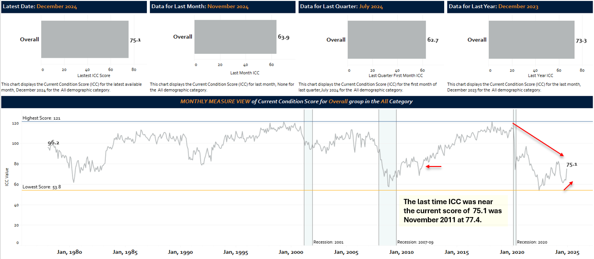
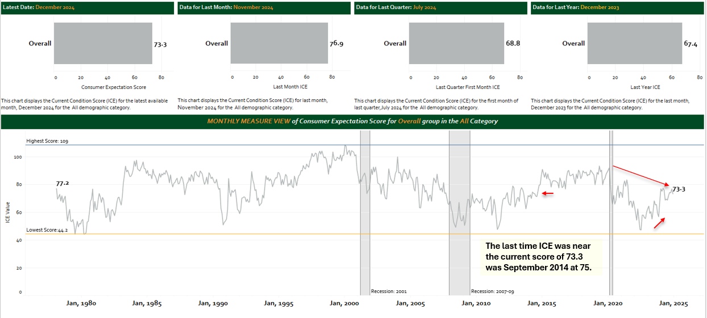
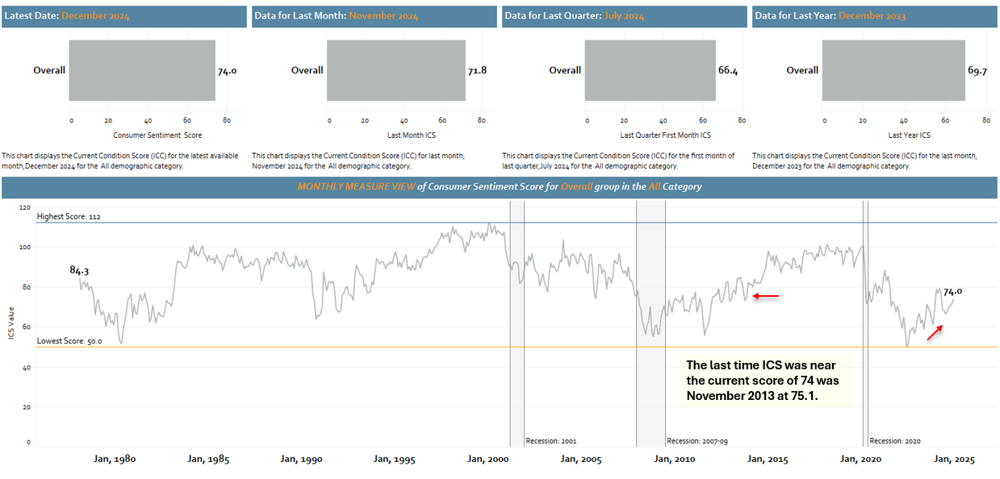
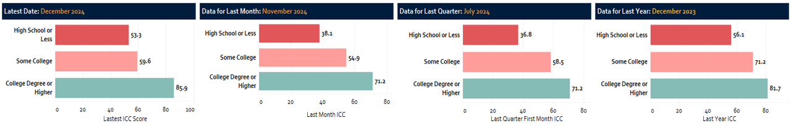
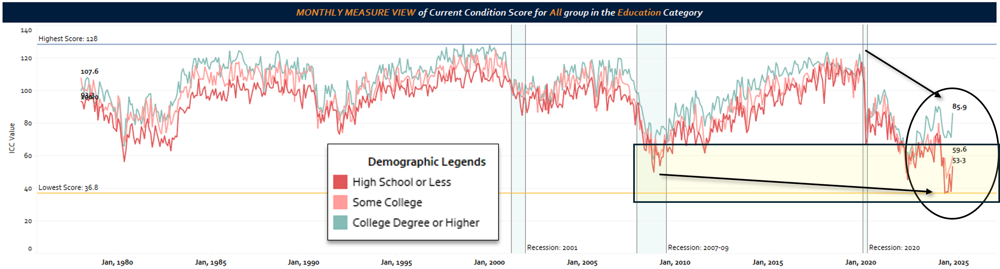
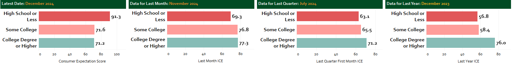
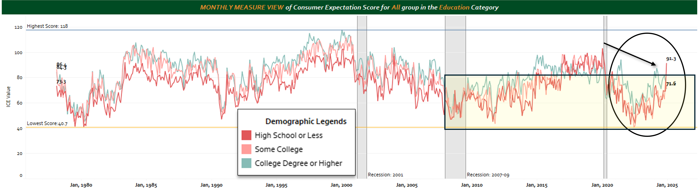

# *ReadMe in Working Progress 

**Quick Summary:** 

**Analyses Conducted:** 

**Visualization:** 

**Link to Tableau Public Dashboard:** 

________________________________________

**Data Source & Preparation** - Downloaded from the University of Michigan’s Surveys of Consumers site (Link here: ). I used Python to restructure the file. This could have also been done with Tableau, but it was more efficient to do it in Python due to the number of columns and demographic groups. 
Full documentation: A copy of the full document is coming soon! 
________________________________________
## Series of Dashboard Analysis: 
## The Lingering Impact of Economic Shocks on Consumer Sentiment
The University of Michigan’s Index of Consumer Current Conditions provides a monthly gauge of how consumers perceive the economy. 
It serves as a key indicator for policymakers, economists, and financial institutions in forecasting economic trends. 
The charts below aggregate the index’s monthly data into quarter-over-quarter changes, offering a clearer view of how consumer sentiment shifts over time.

•	One striking observation is how different consumer perceptions of economic conditions declined during each recession. The 2001 dot-com bubble saw a relatively mild and gradual drop of **27.1** points between May 1999 **(121.1)** and Oct 2001 **(94)**, with a slow recovery spanning five years to reach **113.5** in 2005, still **7.6** points below its pre-recession peak. In contrast, the 2008 financial crisis triggered a far steeper decline of **53.8** points over 8 quarters from Jan 2007 **(111.3)** and Nov 2008 **(57.5)**, with consumer economic perceptions not fully recovering until March 2018 at **121.2**.

•	However, no downturn compares to the unprecedented shock of the 2020 pandemic. The initial collapse was the sharpest on record—a **41.2**-point plunge in just one quarter from Dec 2019 **(115.5)** to April **(74.3)**. While economic perception rebounded temporarily, the recovery was short-lived, coinciding with the rollout of government stimulus payments in 2020 and early 2021. Despite these efforts, the index fell again, bottoming out at **53.8** —43.4 points below the 2021 high of **97.2.**

•	Now, five years after the pandemic, consumer economic perceptions remain significantly depressed at **75.1** as of Dec 2024, much closer to their lowest point than pre-pandemic levels. Historically, economic recoveries have restored consumer perceptions close to prior levels within this timeframe, yet the post-2020 landscape appears different. As further analysis of demographic data suggests, for some groups, economic perceptions are even worse than the overall average of 75.1 at the end of 2024.

## Future Research & Important Questions to Ask

1.	The question remains: has the recovery truly begun, or is consumer confidence stuck in a prolonged period of uncertainty?
   
2.	What needs to occur for consumers’ economic perceptions to improve?
   
3.	Future Research should consider assessing how other economic factors such as  JOLTs (Job Openings), Wage levels, and Inflation, influence consumers’ perceptions of current economic conditions.

________________________________________

## Consumer Expectations and Sentiment: A More Synchronized Recovery
•	Unlike Consumer Current Conditions, Consumer Expectations and Sentiment have moved in closer alignment. Although all metrics are currently in their 70s, Consumer Expectations and Sentiment are closer to the pre-pandemic level than Consumer perceptions of Current Conditions. 

•	In Dec 2019, Consumer Expectations stood at 89 before plunging to a pandemic low of 66 in Jul 2020, then its lowest point of 47 in Jul 2022. Since then, it has rebounded to 73.3 as of Dec 2024. Consumer Sentiment followed a similar trajectory, bottoming out at 71.1 in April 2020 during the pandemic, had a short-lived recovery before bottoming to 50 in July 2022, and recovering to 74.9 as of Dec 2024.

•	Notably, these measures are now mirroring the recovery patterns observed after the 2008 financial crisis, suggesting a more typical post-recession rebound—though whether the momentum will continue remains to be seen. 

## Monthly View of Consumer Expectations

## Monthly View of Consumer Sentiment

## What It Means When Current Conditions Remain Depressed but Expectations & Sentiment Are Improving
### Potential Reasons:
1.	Consumers acknowledge current struggles – Wages, inflation, job security, and economic uncertainty might still be weighing heavily on them, which is why their perceptions of current conditions remain low.

2.	They believe things will get better – The improvement in expectations suggests that people see a light at the end of the tunnel, whether due to factors like falling inflation, job market resilience, or broader economic policies.

3.	Not an all-out recovery – While expectations have improved, they haven’t returned to pre-pandemic levels. This suggests lingering uncertainty—consumers may be hopeful but not entirely convinced of a strong economic rebound.

4.	Not an equal recovery for all – The recovery may also be different across different demographic groups.
   
In short, the current situation suggests that while people don’t feel great about the economy today, they believe things will improve—just not to the extent they once did. 
The key question is whether this optimism will translate into real economic momentum or if uncertainty will keep weighing down consumer behavior.

## Demographic Specific Analysis: 
### Index of Consumer Current Conditions – Income Demographic Breakdown
### Analysis:

________________________________________

### Index of Consumer Current Conditions – Income Demographic Breakdown
### Analysis:

## Conclusion: 

## Future Research: 

